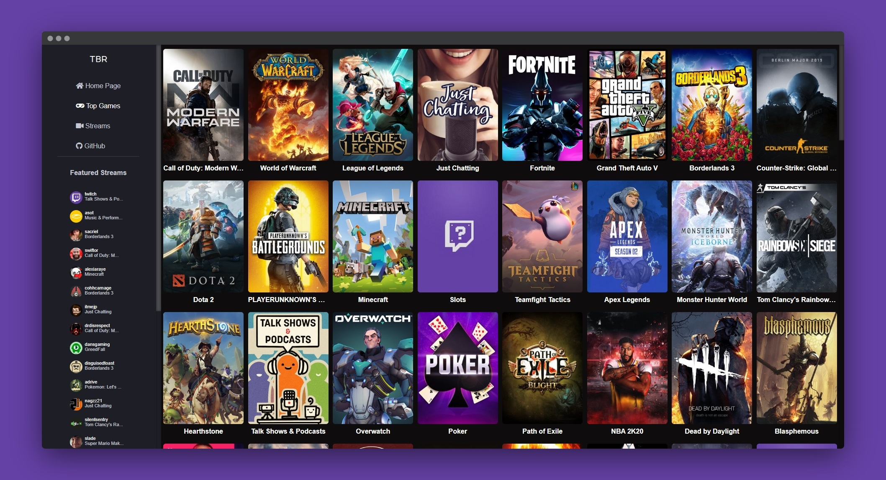

# Twitch Browser React

## [Check live demo!](https://tbr-mf.netlify.com/)

This application was made to browse wallpapers and images using the Reddit API. The app looks for available images in the thread and lists them.

This application was designed and built to browse and watch live Twitch streams. The app lists the streams based upon their view number counts.  

## How to Use

Use the sidebar to navigate between the different options, click on a stream thumbnail or one of the featured streamers avatar and watch the livestream.

## Built With

- React JS
- React Router
- New Twitch API + Twitch API v5 (used the v5 because the new API misses a lot of endpoints)
- SCSS
